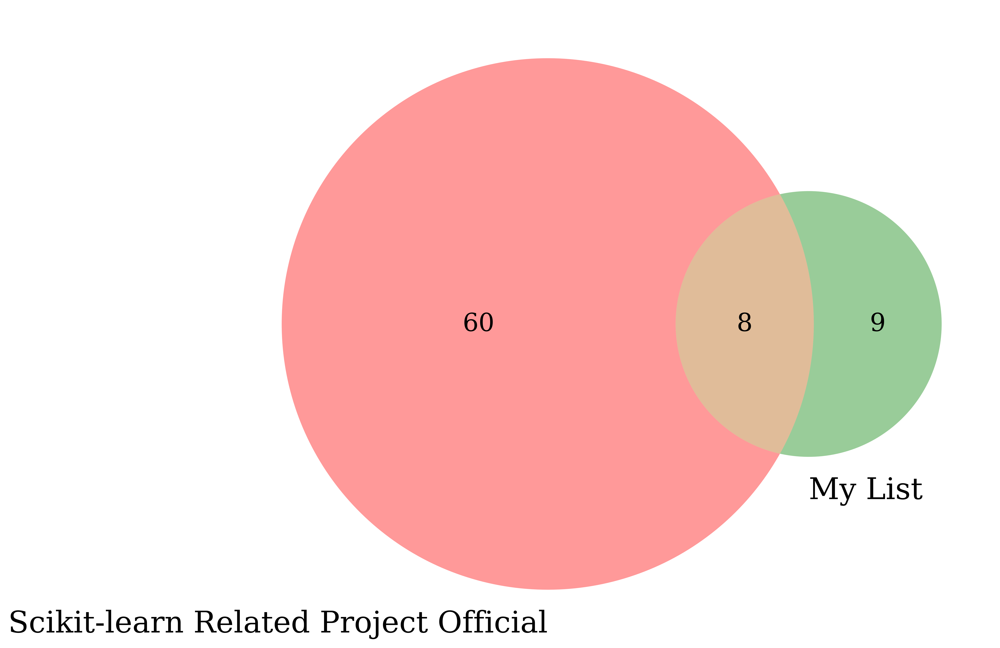

Zoo of scikit-learn related projects
------------------------------------

With the popularity of `scikit-learn` many projects follow a similar API to ensure compatibility. The developers of `scikit-learn` recognize this trend and list various related projects: [Related projects](https://scikit-learn.org/stable/related_projects.html), [scikit-learn-contrib](https://github.com/scikit-learn-contrib), [scikit-learn-contrib repo](https://github.com/scikit-learn-contrib/scikit-learn-contrib).

I have found a few projects both on and off the list from SciKit's official aggregation.

    

Below is my list of just the differences from the above venn diagram:

* [pdpipe](https://github.com/pdpipe/pdpipe)
* [pulearn](https://github.com/pulearn/pulearn)
* [scikit-multiflow](https://github.com/scikit-multiflow/scikit-multiflow)
* [pymc-learn](https://github.com/pymc-learn/pymc-learn/)
* [ml-insights](https://github.com/numeristical/introspective)
* [fancyimpute](https://github.com/iskandr/fancyimpute)
* [feature_engine](https://github.com/solegalli/feature_engine)
* [metric-learn](https://github.com/scikit-learn-contrib/metric-learn)
* [autoimpute](https://github.com/kearnz/autoimpute)

Finally the full list of projects:

* [imbalanced-learn](https://github.com/scikit-learn-contrib/imbalanced-learn)
* [scikit-multilearn](https://github.com/scikit-multilearn/scikit-multilearn)
* [mlxtend](https://github.com/rasbt/mlxtend)
* [sklearn-onnx](https://github.com/onnx/sklearn-onnx)
* [scikit-lego](https://github.com/koaning/scikit-lego)
* [feature_engine](https://github.com/solegalli/feature_engine)
* [fancyimpute](https://github.com/iskandr/fancyimpute)
* [pulearn](https://github.com/pulearn/pulearn)
* [pymc-learn](https://github.com/pymc-learn/pymc-learn/)
* [pdpipe](https://github.com/pdpipe/pdpipe)
* [sklearn_pandas](https://github.com/scikit-learn-contrib/sklearn-pandas)
* [metric-learn](https://github.com/scikit-learn-contrib/metric-learn)
* [scikit-multiflow](https://github.com/scikit-multiflow/scikit-multiflow)
* [ml-insights](https://github.com/numeristical/introspective)
* [yellowbrick](https://github.com/districtdatalabs/yellowbrick)
* [autoimpute](https://github.com/kearnz/autoimpute)